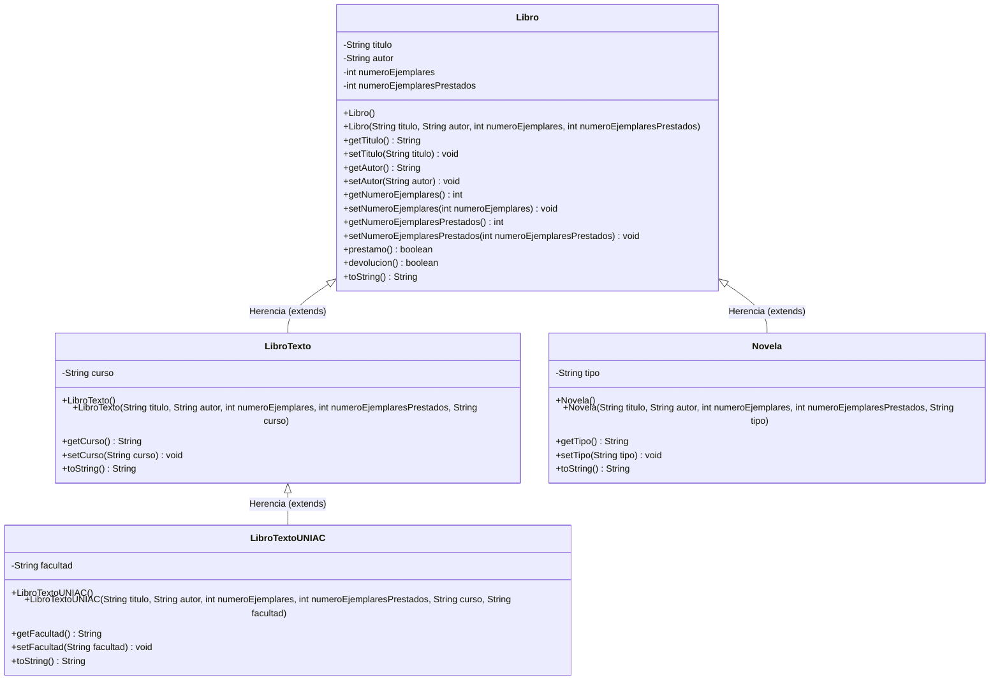

# Parcial I - Programación II (G411) - UNIAJC

**Institución:** Institución Universitaria Antonio José Camacho (UNIAJC)  
**Asignatura:** Programación II 
**Integrantes:** Esneider Espitia, Alexander Velasco
**Tema:** POO - Abstracción, Encapsulamiento y Herencia con Maven + GIT  
**Arquitectura del Proyecto:** Maven Standard Directory Layout  

---

## Descripción del Proyecto

Sistema de gestión de biblioteca desarrollado en Java aplicando los cuatro pilares de la Programación Orientada a Objetos (POO), con énfasis en:
- **Abstracción:** Modelado de entidades del mundo real (`Libro`, `LibroTexto`, `LibroTextoUNIAC`, `Novela`).
- **Encapsulamiento:** Ocultamiento de información mediante atributos privados y métodos de acceso (`getters` / `setters`), controlando la consistencia del estado.
- **Herencia:** Reutilización y jerarquización de código a través de la relación de especialización `is-a` (es-un).
- **Polimorfismo / Sobreescritura:** Redefinición del método `toString()` en cada subclase para representación personalizada.

---

##Diagrama UML de Clases



---

## Estructura del Proyecto (Maven Layout)

```text
Parcial UNO/
├── pom.xml
├── .gitignore
├── README.md
├── Parcial I - Programación II - 2026-2 - G411.pdf
└── src/
    └── main/
        └── java/
            └── edu/
                └── uniajc/
                    ├── Main.java
                    └── model/
                        ├── Libro.java
                        ├── LibroTexto.java
                        ├── LibroTextoUNIAC.java
                        └── Novela.java
```

---

## Compilación y Ejecución

### Requisitos
- **Java JDK 17+** (o JDK 21 / 25)
- **Apache Maven 3.8+**

### Comandos de Ejecución

1. **Compilar el proyecto:**
   ```bash
   mvn clean compile
   ```

2. **Ejecutar el programa interactivo:**
   ```bash
   mvn exec:java
   ```

---

## Pruebas Implementadas en la Clase `Main` (1.0 Ptos)

En la clase `Main.java` se implementó un sistema interactivo por consola mediante un **menú de opciones** y la creación de los 4 objetos requeridos:

1. **`libro1`**: Creado usando el **constructor con parámetros**.
2. **`libro2`**: Creado con el **constructor por defecto** y capturando sus datos por consola mediante `Scanner`.
3. **`libroTextoUNIAC`**: Creado con todos sus atributos (título, autor, ejemplares, prestados, curso y facultad).
4. **`novela`**: Creado indicando su tipo (ej. *histórica, romántica, policíaca, realista, ciencia ficción, aventuras*).

### Menú Interactivo de Pruebas:
El programa inicia registrando `libro2` y desplegando un menú en bucle para que el usuario pueda:
1. **Ver inventario completo**: Muestra todos los libros con sus datos y ejemplares disponibles calculados.
2. **Realizar préstamo**: Seleccionar cualquier libro para prestarlo. Incrementa los prestados si hay disponibles (`true`) o notifica error si no quedan disponibles (`false`).
3. **Realizar devolución**: Seleccionar cualquier libro para devolverlo. Decrementa los prestados si hay alguno prestado (`true`) o notifica error si no había ejemplares prestados (`false`).
4. **Modificar datos de libro2**: Permite actualizar interactivamente los atributos de `libro2`.
5. **Salir del sistema**: Finaliza la ejecución del programa de forma controlada.

---

## Análisis Teórico: Situaciones donde NO se puede realizar la Herencia

A continuación se identifican dos situaciones específicas en el lenguaje Java donde la herencia queda imposibilitada:

### Situación 1: Uso del modificador de no mutabilidad/extensión `final` en la clase base

* **Explicación:** Si una clase es declarada con la palabra reservada `final`, el compilador de Java prohíbe explícitamente que cualquier otra clase pueda extenderla (`extends`).
* **Fragmento de código con la falla:**
  ```java
  // Si la clase padre tuviera el modificador final:
  public final class Libro {
      // Atributos y métodos
  }

  // Al intentar heredar:
  public class LibroTexto extends Libro { // ERROR DE COMPILACIÓN: Cannot inherit from final 'edu.uniajc.model.Libro'
      private String curso;
  }
  ```
* **Consecuencia:** Se bloquea el principio de extensión y reutilización jerárquica de clases.

---

### Situación 2: Constructor de la clase padre privado (`private`) sin constructores accesibles

* **Explicación:** En Java, todo constructor de una subclase debe invocar explícita o implícitamente a un constructor de la superclase mediante `super()`. Si la clase padre declara únicamente constructores con modificador de acceso `private`, ninguna subclase puede invocar `super()`, imposibilitando la instanciación y la herencia directa.
* **Fragmento de código con la falla:**
  ```java
  public class Libro {
      private String titulo;

      // Constructor privado (patrón Singleton / Factory o restricción):
      private Libro() {
          this.titulo = "";
      }
  }

  public class Novela extends Libro {
      public Novela() {
          super(); // ERROR DE COMPILACIÓN: 'Libro()' has private access in 'edu.uniajc.model.Libro'
      }
  }
  ```
* **Consecuencia:** La subclase no puede compilar puesto que no tiene visibilidad para inicializar el estado base del objeto padre.

*(Otras situaciones válidas incluyen: herencia múltiple de clases en Java mediante `extends`, modificador de acceso `package-private` / default cuando la subclase está en un paquete diferente).*

---

## Propuesta de Nuevos Atributos y Método Adicional

Para enriquecer el sistema de gestión de biblioteca, se proponen las siguientes adiciones coherentes con el dominio del problema:

### 1. Dos Nuevos Atributos
1. **`isbn` (`String`)**:
   * *Descripción:* Código Internacional Normalizado del Libro (ej. `"978-0-13-468599-1"`). Permite identificar de manera unívoca a cada edición del libro en catálogos globales e inventarios.
2. **`precioBase` (`double`)**:
   * *Descripción:* Valor monetario o costo de reposición del ejemplar en caso de pérdida o daño.

### 2. Un Método Adicional
* **`public double calcularMulta(int diasRetraso, double tarifaPorDia)`**:
  * *Descripción:* Calcula el monto económico a pagar por el usuario si devuelve el ejemplar después de la fecha límite acordada.
  * *Implementación propuesta:*
    ```java
    public double calcularMulta(int diasRetraso, double tarifaPorDia) {
        if (diasRetraso <= 0) {
            return 0.0;
        }
        return diasRetraso * tarifaPorDia;
    }
    ```
  * *Alternativa:* Método `public int consultarDisponibles()` que retorna `numeroEjemplares - numeroEjemplaresPrestados`.
